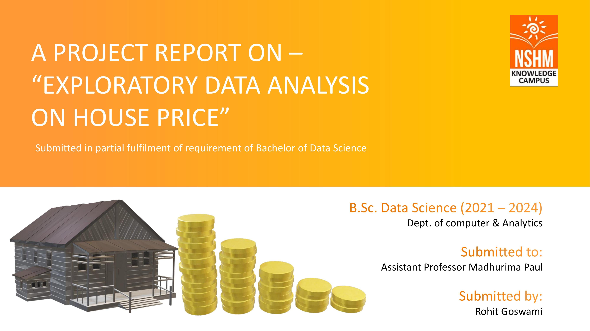

# ExploratoryDataAnalysis_HousePrice

I have used the pandas, matplotlib and seaborn libraries for this particular project to load, clean, visualize and make sense of the dataset.

## Data Description
There are 1460 instances of training data. Total number of attributes equals 81, of which 36 is quantitative, 43 categorical, Id and SalePrice.
Quantitative: EnclosedPorch, Fireplaces,GrLivArea, HalfBath, KitchenAbvGr, LotArea, YearBuilt, YrSold
Qualitative: Alley, CentralAir, Electrical, GarageQual, GarageType, Heating, Neighborhood.

The mean price of the houses are 182470.369733. The most costly house is worth 755000 and the cheapest one is worth 34900. However there are some irregularities in count in some of the columns.

## 1. Visualization of SalePrice(Target Variable(y))

## Conclusion
The sales price follows a bell curve and is noramlly distributed with mean price of 182470.369733 and Standard Deviation of 83251.315928. So we can assume that majority of house price should be between 100000 to 250000.

Here the "Overall Quality of the house", "Living Area" and "Total Surface area" show very strong positive correlation with the price of the house

Most house in the dataset have overall 5 rating (average). As the rating increase the house price will increase significantly. Highest Average Price of houses have a 10 rating including the most costly house of the dataset and Houses with 9 rating have the smallest standard deviation.

Most number of houses are in zones with Low Density and Floating Village have the highest mean price.

House with no access to any alley have the highest average price followed by paved alley and gravel alley. The most expensive house in dataset have no alley access

The Price of a House is strongly correlated with the Number of Rooms and Bathrooms present.The most number of rooms in a house is 16, however most expensive house of the dataset(Price="755000.0") have 14 Total Rooms. Average Price of a House with 14 rooms is highest and House with 4 rooms is Lowest.

The most commonly used Foundations for a house are "Poured Contrete", "Cinder Block" and "Brick Tile". The most expensive type of Foundation for a house is "Poured Contrete" followed by "Wood" and "Stone". The most expensive house (Price="755000.0") is built with "Poured Contrete" and the cheapest house in the dataset (Price="34900.0") is made with "Cinder Block".

The area of basement and Price of the house shows strong positive correlation as shown in the Scatterplot that means we can conclude a larger area of the basement adds more value to the house and increases its sale price.

North Ridge region have the highest avegare sale price whereas the Meadow Village have the lowest average sale price. North Ames have the most number house on sale. North Ridge has the most expensive house(Price=755000.0) and Iowa DOT and Rail Road have the cheapest house(Price=34900.0) of the dataset.

There is a moderate positive correaltion between the number of Fireplaces and Price. Only 5 Houses have more than 3 Fireplaces and the Average Price of the houses are higher than the other houses. However The Most Expensive house of the dataset have only 2 Fireplaces so there must be other strong factors that affect the price.

The area of Garage is strongly correlated with Price and from the scatterplot we can see a positive slop. So, one can conclude that with increase in garage area the price of house will increase by some amount. The Condition of the Garage is also an Important factor here as well. Most of the Houses have 3 rating or Avegare Rating and have the highest avegare price.

Average age of the houses in the dataset is 37. The Regression Scatterplot show a Negetive Correlation between the age and Price which means the price of houses will decrease over time.

Total Surface Area of the House which includes all 1st, 2nd and Basement floor in Square feet is Strongly Correlated with the Price. Average size of the houses are 2596sq.ft and The house with biggest area indoor is 11752sq.ft big.

Most commonly used elelctric system is Standard Circuit Breakers & Romex , The most expensive house of the dataset also uses the electric system and the average value of the system is higher than the rest. Mix electric system is used in only one house.
